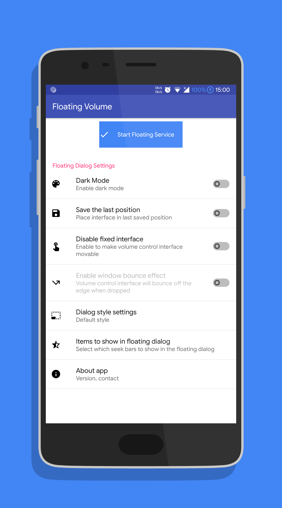
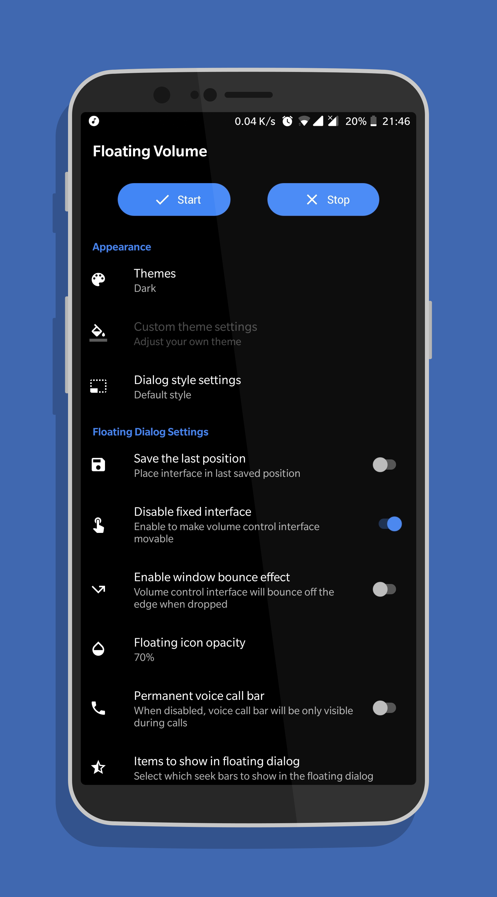
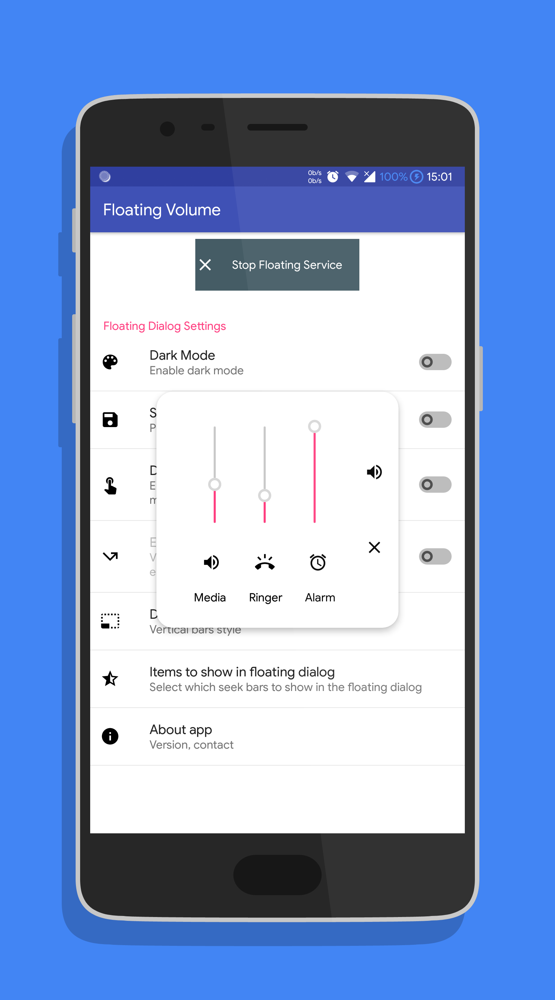
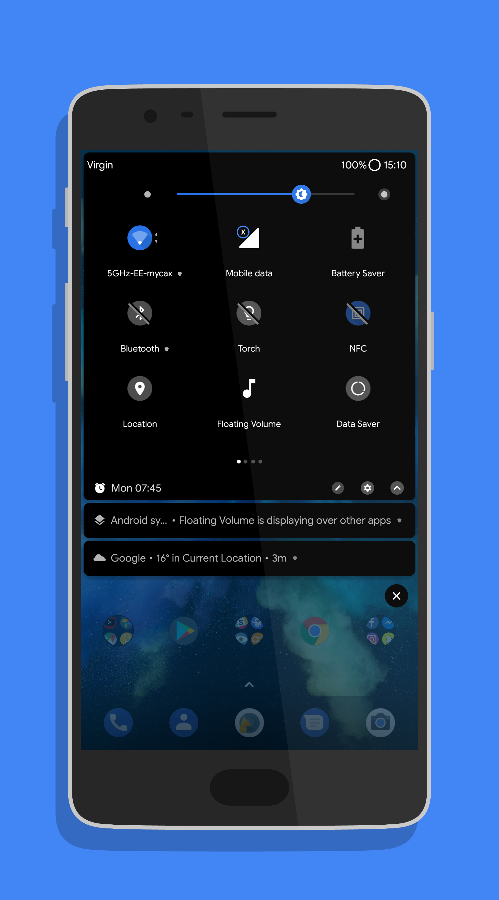
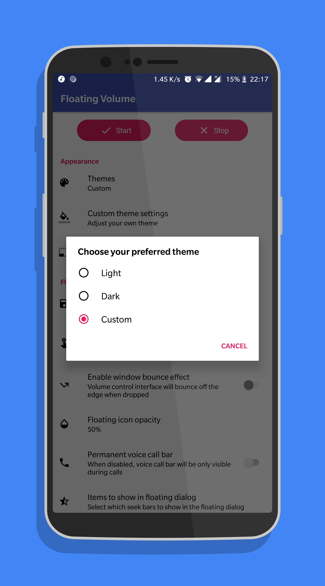
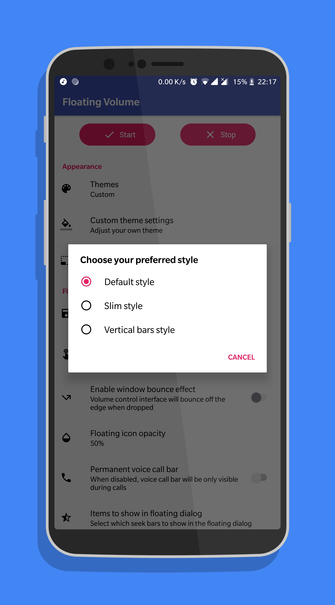
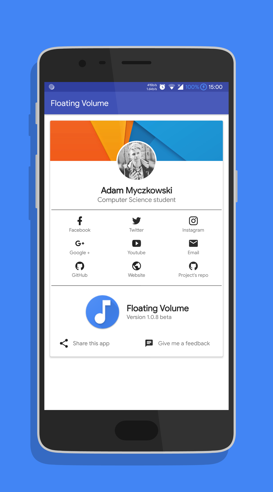
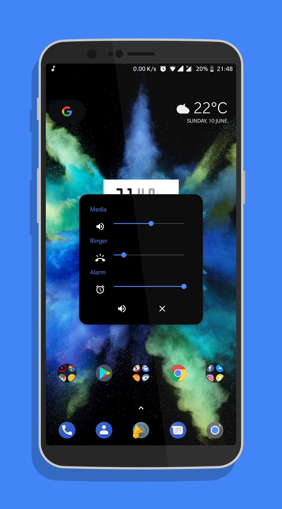

# Floating Volume
Floating Volume is a simple Android 5.0+ app that allows you to control media, ringer, alarm and in-call volume, and switch between ringer modes within the floating interface.

## Features
* Themes: Default, Dark and Custom - choose between a range of predefined colors
* Save last position of floating interface (head and volume interface positions are independent)
* Start/stop service directly from quick settings tile
* Volume control interface can be movable or fixed in centre
* Show and hide dialog controls
* Choose between 3 different dialog styles
* Change icon opacity

## Gallery

## Notice
More stuff to come, bug reports and feature requests welcome!

# License

    Copyright 2018 Adam Myczkowski

    Licensed under the Apache License, Version 2.0 (the "License");
    you may not use this file except in compliance with the License.
    You may obtain a copy of the License at

       http://www.apache.org/licenses/LICENSE-2.0

    Unless required by applicable law or agreed to in writing, software
    distributed under the License is distributed on an "AS IS" BASIS,
    WITHOUT WARRANTIES OR CONDITIONS OF ANY KIND, either express or implied.
    See the License for the specific language governing permissions and
    limitations under the License.
